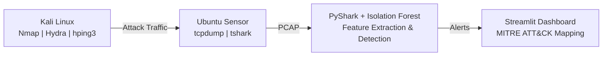

# ai-network-traffic-analyzer

## Architecture 

## Workflow

1. Generate attack traffic from a Kali Linux VM.
2. Capture packets using tcpdump and tshark on an Ubuntu sensor VM.
3. Store traffic in PCAP files for analysis.
4. Parse packets with PyShark.
5. Extract network behavior features.
6. Train and run an Isolation Forest anomaly detection model.
7. Map detected behaviors to MITRE ATT&CK techniques.
8. Display findings through a Streamlit dashboard.

## Detection Techniques

- Statistical Feature Extraction
- Isolation Forest Anomaly Detection
- MITRE ATT&CK Mapping

## Technologies

- Python
- PyShark
- TShark
- Pandas
- Scikit-learn
- Streamlit