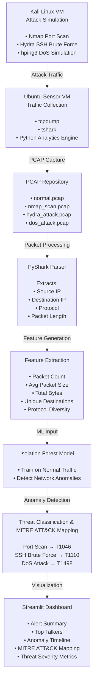

# AI-Powered Network Threat Detection Pipeline

## Overview

This project simulates real-world cyberattacks in a controlled lab environment, captures network traffic, extracts packet-level features, performs machine learning-based anomaly detection, maps findings to the MITRE ATT&CK framework, and visualizes results through an interactive Streamlit dashboard.

## Architecture



## Workflow

1. Generate attack traffic from a Kali Linux VM.
2. Capture packets using tcpdump and tshark on an Ubuntu sensor VM.
3. Store traffic in PCAP files for analysis.
4. Parse packets with PyShark.
5. Extract network behavior features.
6. Train and run an Isolation Forest anomaly detection model.
7. Map detected behaviors to MITRE ATT&CK techniques.
8. Display findings through a Streamlit dashboard.

## MITRE ATT&CK Mapping

| Attack Type | Technique ID | Technique |
|------------|-------------|------------|
| Port Scan | T1046 | Network Service Discovery |
| SSH Brute Force | T1110 | Brute Force |
| DoS Attack | T1498 | Network Denial of Service |

## Technology Stack

- Kali Linux
- Ubuntu Server
- Nmap
- Hydra
- hping3
- tcpdump
- tshark
- PyShark
- Pandas
- Scikit-Learn
- Isolation Forest
- Streamlit
- MITRE ATT&CK Framework

## Dashboard Features

- Real-time Alert Summary
- Top Network Talkers
- Anomaly Detection Results
- MITRE ATT&CK Technique Mapping
- Threat Severity Visualization
- Historical Event Analysis

## Project Structure

```text
├──README.md
├── requirements.txt
│
├── data/
│   ├── raw/
│   │   ├── normal.pcap
│   │   ├── nmap_scan.pcap
│   │   ├── hydra_attack.pcap
│   │   └── dos_attack.pcap
│   │
│   ├── processed/
│   │   └── features.csv
│   │
│   └── models/
│       └── isolation_forest.pkl
│
├── screenshots/
│
└── src/
    ├── core/
    │   ├── config.py
    │   └── logger.py
    │
    ├── parsers/
    │   └── pyshark_parser.py
    │
    ├── features/
    │   └── feature_extractor.py
    │
    ├── detection/
    │   ├── anomaly_detector.py
    │   └── mitre_mapper.py
    │
    ├── dashboard/
    │   └── app.py
    │
    └── main.py
```