# AI-Powered Network Traffic Analyzer

An end-to-end defensive-security project that captures controlled network traffic, converts PCAP files into behavioural time windows, classifies simulated attacks with a Random Forest model, enriches detections with MITRE ATT&CK context, deduplicates repeated alerts, and presents the results in an interactive Streamlit SOC dashboard.

> **Scope:** All attack simulations shown in this repository were performed in an isolated, authorized lab environment.

## Project Highlights

- Captured and inspected network traffic with `tcpdump` and Wireshark
- Simulated Nmap reconnaissance, Hydra SSH brute-force activity, and hping3 DoS traffic
- Parsed **20 PCAP captures** with Scapy
- Converted packet traffic into **4,809 10-second source-IP behavioural windows**
- Trained a multiclass Random Forest classifier
- Used **capture-separated evaluation** to reduce train/test leakage
- Achieved **92% accuracy** and **0.94 weighted F1-score**
- Added probability-based confidence, risk scoring, and MITRE ATT&CK enrichment
- Deduplicated repeated detections into analyst-oriented alerts
- Built an interactive Streamlit SOC dashboard with KPIs, alert filtering, model analysis, and incident timelines

---

## End-to-End Architecture

```text
┌──────────────────────────────────────────┐
│ Kali Linux Attack Simulation             │
│ Nmap • Hydra • hping3                    │
└────────────────────┬─────────────────────┘
                     │ controlled lab traffic
                     ▼
┌──────────────────────────────────────────┐
│ Ubuntu Sensor / Target VM                │
│ tcpdump packet capture                   │
└────────────────────┬─────────────────────┘
                     │ PCAP files
                     ▼
┌──────────────────────────────────────────┐
│ Scapy PCAP Parser                        │
│ IPs • Ports • Protocols • TCP Flags      │
└────────────────────┬─────────────────────┘
                     │ packet records
                     ▼
┌──────────────────────────────────────────┐
│ Behavioural Feature Engineering          │
│ 10-second source-IP windows              │
└────────────────────┬─────────────────────┘
                     │ numeric feature matrix
                     ▼
┌──────────────────────────────────────────┐
│ Random Forest Classifier                 │
│ Prediction • Probability • Confidence    │
└────────────────────┬─────────────────────┘
                     │ detections
                     ▼
┌──────────────────────────────────────────┐
│ SOC Enrichment                           │
│ Severity • Risk Score • MITRE ATT&CK     │
└────────────────────┬─────────────────────┘
                     │ enriched detections
                     ▼
┌──────────────────────────────────────────┐
│ Alert Deduplication and Timeline         │
│ First Seen • Last Seen • Occurrences     │
└────────────────────┬─────────────────────┘
                     │ analyst-ready alerts
                     ▼
┌──────────────────────────────────────────┐
│ Streamlit SOC Dashboard                  │
│ KPIs • Filters • Alerts • Timeline       │
└──────────────────────────────────────────┘
```

---

# 1. Lab Setup and Connectivity

The project uses a Kali Linux VM for controlled attack generation and an Ubuntu VM as the monitored target and packet-capture sensor. Connectivity was validated before traffic collection.

<p align="center">
  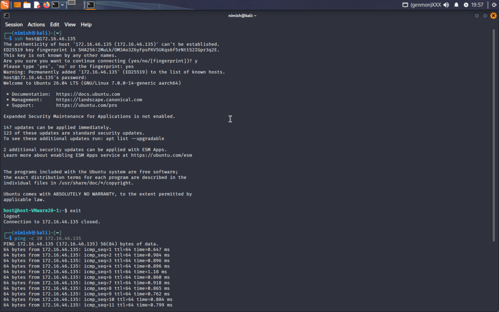
</p>

---

# 2. Baseline Traffic Collection

Normal traffic was captured on the Ubuntu sensor using `tcpdump`.

<p align="center">
  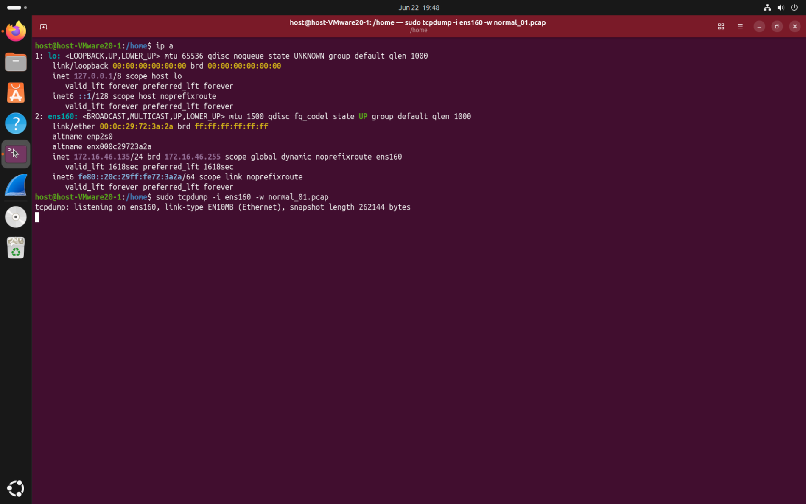
</p>

DNS lookups and normal network activity were generated to build baseline captures.

<p align="center">
  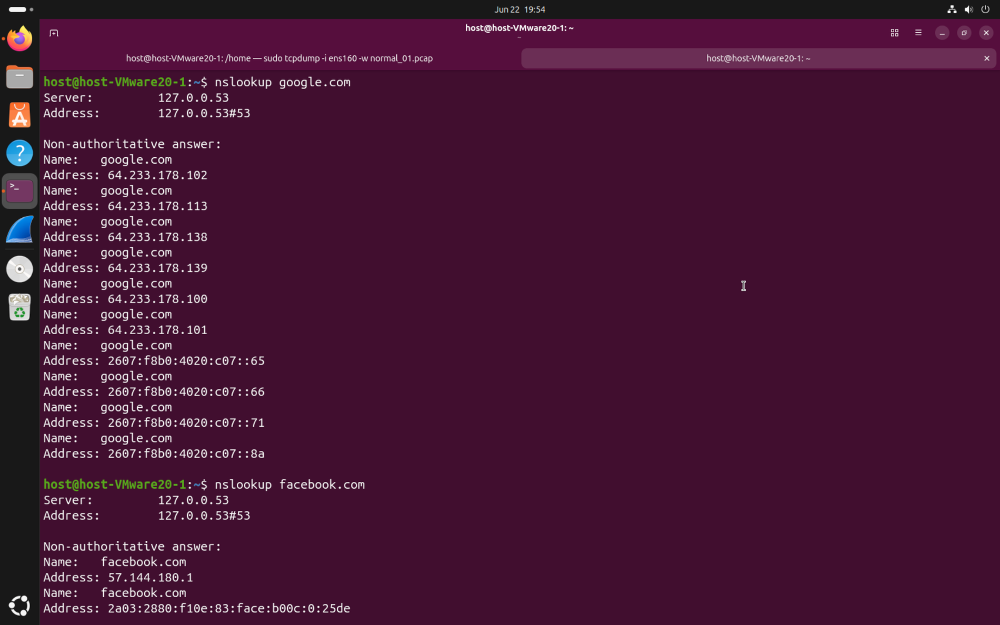
</p>

The resulting PCAP was reviewed in Wireshark to validate packet direction, addresses, protocols, ports, and packet sizes.

<p align="center">
  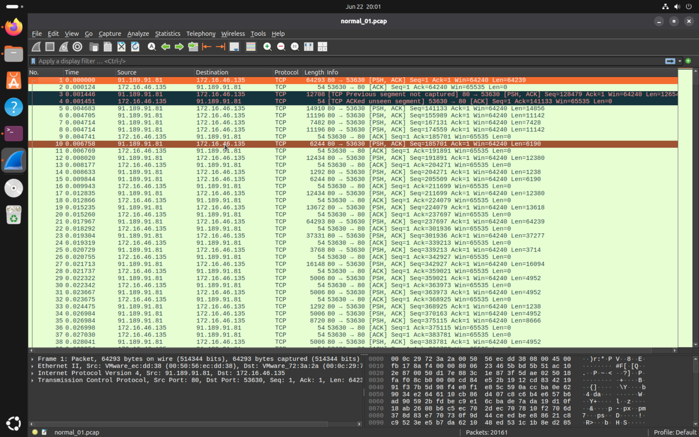
</p>

---

# 3. Controlled Attack Simulation

## Nmap Reconnaissance

Multiple Nmap scan types were generated to create network-service discovery and port-scanning behaviour.

<p align="center">
  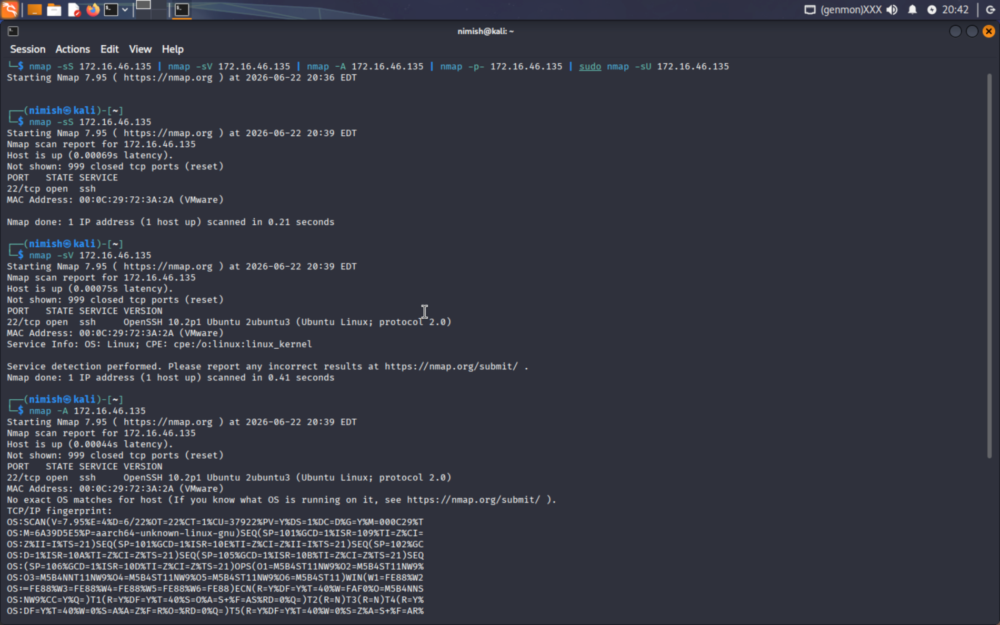
</p>

**MITRE ATT&CK:** `T1046 – Network Service Discovery`

## Hydra SSH Brute Force

The Ubuntu sensor captured SSH traffic while Hydra generated repeated authentication attempts.

<p align="center">
  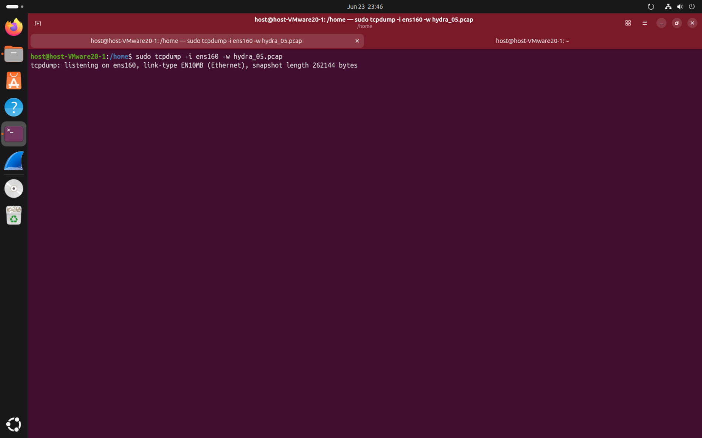
</p>

<p align="center">
  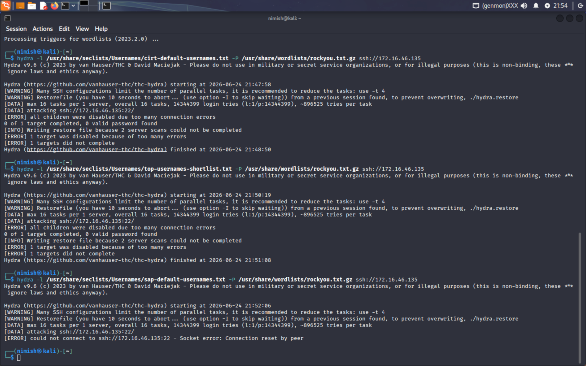
</p>

**MITRE ATT&CK:** `T1110 – Brute Force`

## Denial-of-Service Simulation

A controlled hping3 flood was used to generate high-volume DoS behaviour.

<p align="center">
  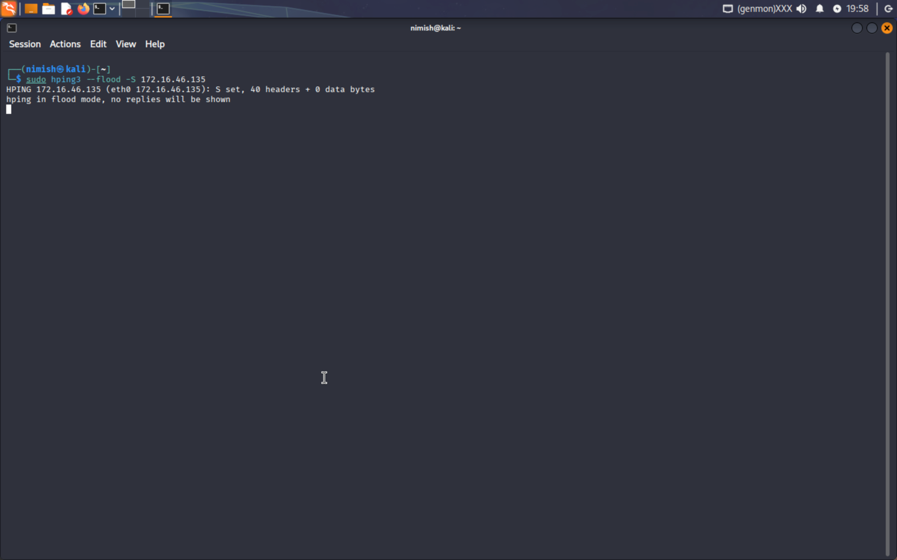
</p>

**MITRE ATT&CK:** `T1498 – Network Denial of Service`

---

# 4. PCAP Parsing and Behavioural Dataset Engineering

The Scapy-based data builder converts raw PCAP traffic into fixed **10-second source-IP behavioural windows**.

The processing run shows individual DoS, Hydra, Nmap, and normal captures being parsed and transformed into feature windows.

<p align="center">
  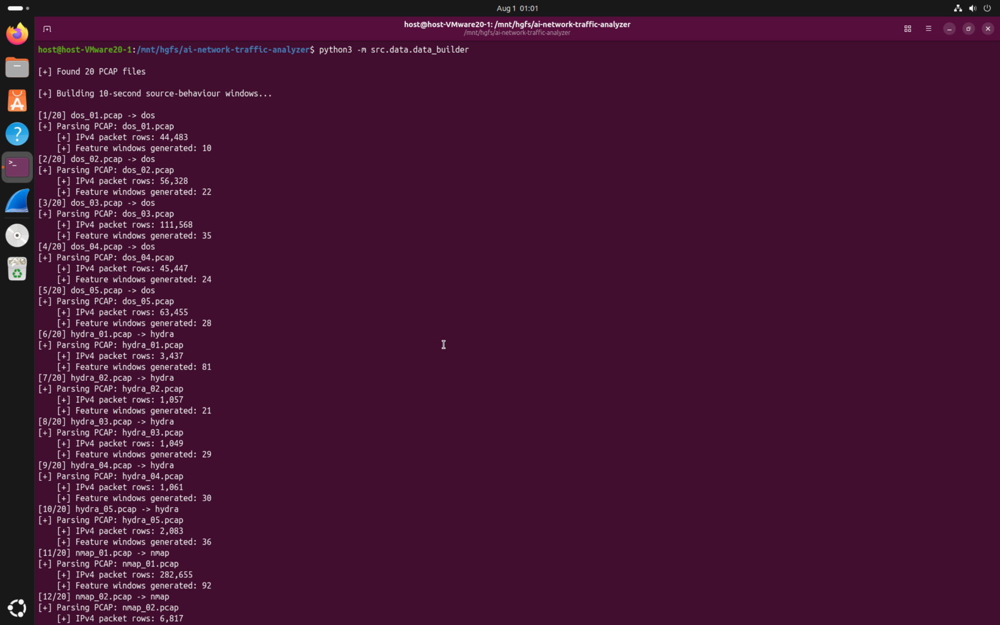
</p>

The completed build produced **4,809 rows and 30 columns**.

<p align="center">
  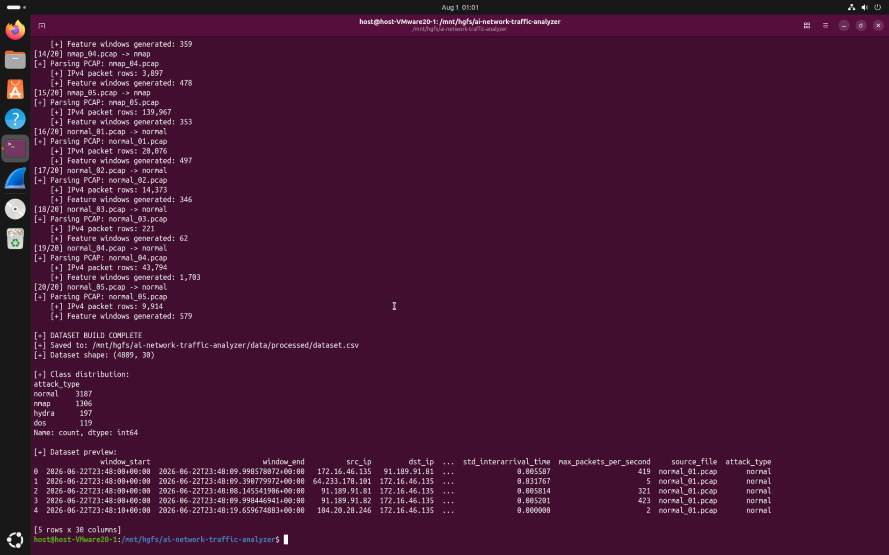
</p>

## Dataset Distribution

| Traffic class | Behavioural windows |
|---|---:|
| Normal | 3,187 |
| Nmap | 1,306 |
| Hydra | 197 |
| DoS | 119 |
| **Total** | **4,809** |

The dataset retains timestamps, source/destination information, ports, protocol information, source filename, and class labels for investigation and traceability.

<p align="center">
  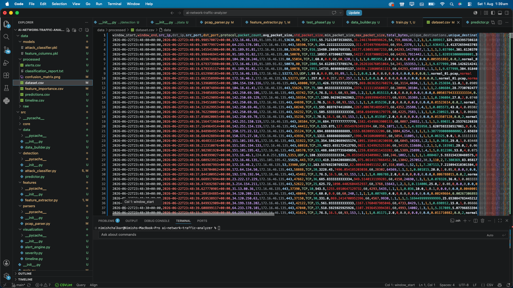
</p>

## Behavioural Features

The Random Forest uses numeric network-behaviour features including:

- Packet count
- Average packet size
- Minimum and maximum packet size
- Packet-size standard deviation
- Total bytes
- Unique destinations
- Unique source ports
- Unique destination ports
- Protocol diversity
- Flow duration
- Packets per second
- SYN count and ratio
- RST count and ratio
- SSH packet count and ratio
- Average packet inter-arrival time
- Standard deviation of inter-arrival time
- Maximum packets per second

IP addresses, timestamps, ports, protocol labels, and source filenames are retained as analyst metadata rather than model features.

---

# 5. Machine-Learning Training and Evaluation

The model is a multiclass `RandomForestClassifier`. Complete PCAP captures are held out for testing so that windows from the same source capture do not appear in both training and test sets.

## Training and Testing Distribution

<p align="center">
  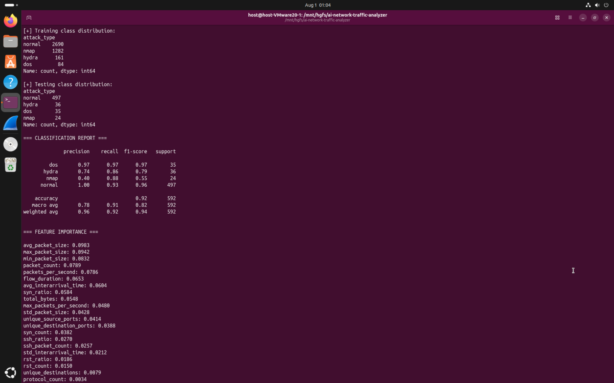
</p>

## Classification Results

| Class | Precision | Recall | F1-score | Support |
|---|---:|---:|---:|---:|
| DoS | 0.97 | 0.97 | 0.97 | 35 |
| Hydra | 0.74 | 0.86 | 0.79 | 36 |
| Nmap | 0.40 | 0.88 | 0.55 | 24 |
| Normal | 1.00 | 0.93 | 0.96 | 497 |
| **Accuracy** |  |  | **0.92** | **592** |
| **Macro average** | **0.78** | **0.91** | **0.82** | **592** |
| **Weighted average** | **0.96** | **0.92** | **0.94** | **592** |

The classifier correctly classified **547 of 592** capture-separated test windows.

DoS and normal traffic showed the strongest performance. Nmap achieved **88% recall**, detecting most scan windows, but its lower precision reflects false positives. The confusion matrix shows that **28 normal windows** and **4 Hydra windows** were predicted as Nmap.

This is treated as a realistic SOC alert-fatigue challenge rather than hidden from the evaluation. Future work focuses on scan-specific behavioural features and confidence-threshold tuning.

<p align="center">
  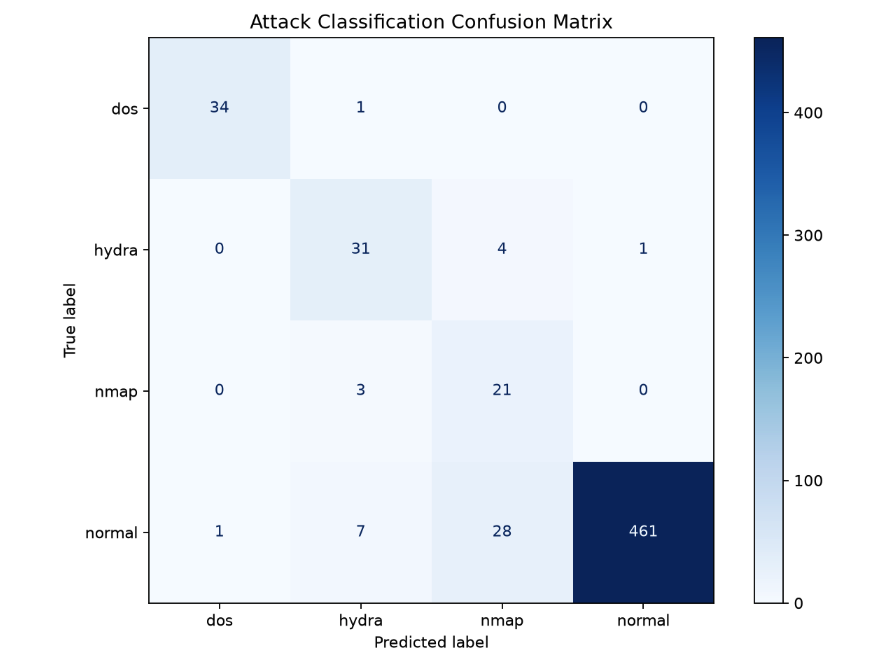
</p>

## Feature Importance

<p align="center">
  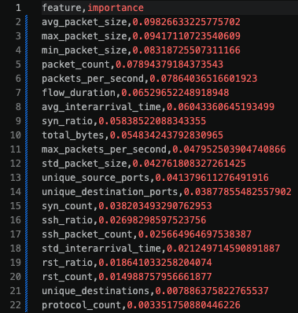
</p>

<details>
<summary><strong>Additional model-evaluation evidence</strong></summary>

<br>

Earlier generated confusion-matrix artifact:

<p align="center">
  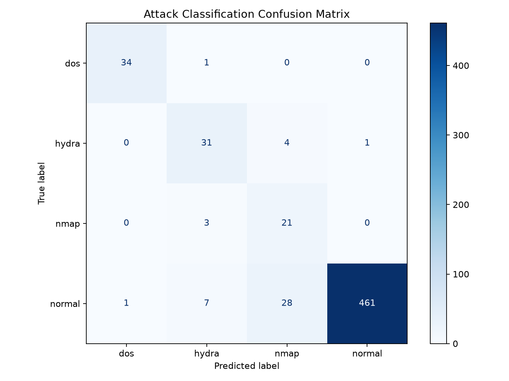
</p>

</details>

---

# 6. SOC Detection and Enrichment Pipeline

After training, the pipeline:

1. Loads the generated behavioural dataset
2. Loads the trained model and persisted feature schema
3. Generates predicted attack labels
4. Calculates prediction confidence
5. Applies severity and risk scoring
6. Maps detections to MITRE ATT&CK
7. Deduplicates repeated alerts
8. Generates an incident timeline

<p align="center">
  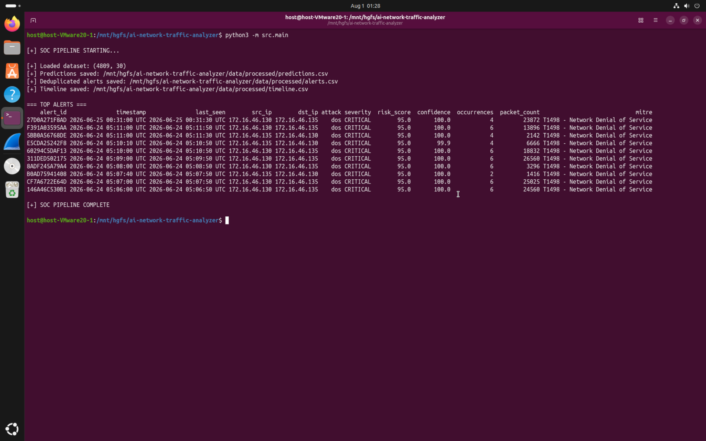
</p>

The pipeline creates:

```text
data/processed/
├── alerts.csv
├── classification_report.txt
├── confusion_matrix.png
├── dataset.csv
├── feature_importance.csv
├── predictions.csv
└── timeline.csv
```

<p align="center">
  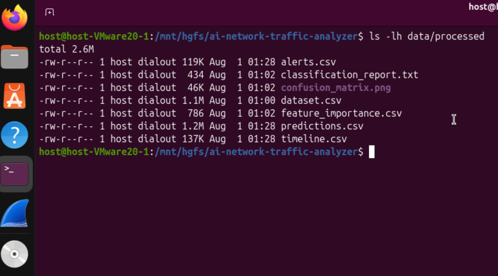
</p>

---

# 7. SOC Alert Enrichment

The alert dataset transforms raw ML detections into analyst-oriented records.

Each alert includes:

- Alert ID
- First-seen timestamp
- Last-seen timestamp
- Source IP
- Destination IP
- Attack classification
- Severity
- Risk score
- Model confidence
- Occurrence count
- Packet count
- MITRE ATT&CK mapping

<p align="center">
  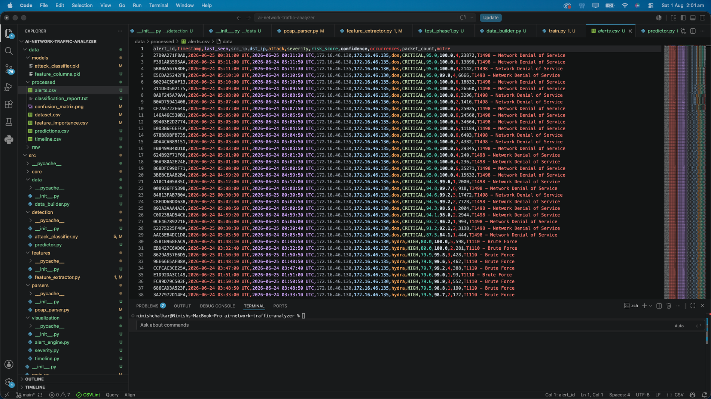
</p>

<p align="center">
  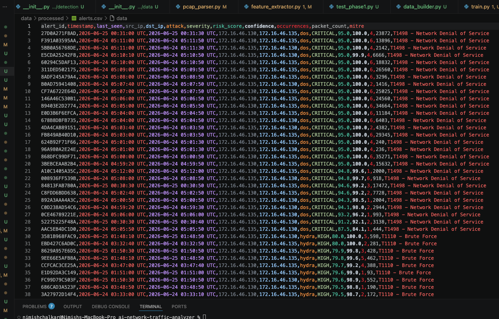
</p>

---

# 8. Streamlit SOC Dashboard

The Streamlit interface turns the generated detections into an interactive investigation workflow.

## Dashboard Overview

The main view summarizes the complete dataset and alert workload:

- **4,809 traffic windows**
- **1,660 suspicious windows**
- **851 deduplicated alerts**
- **28 critical alerts**

It also visualizes attack-class and severity distributions.

<p align="center">
  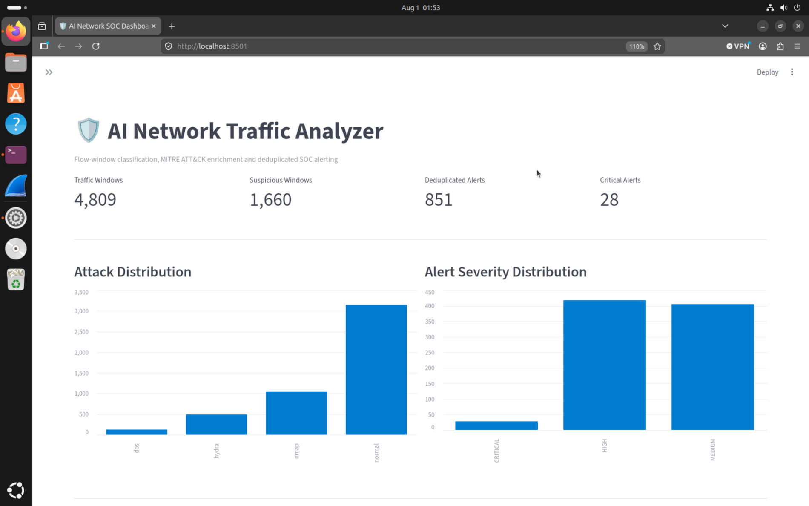
</p>

## Deduplicated Alert Feed

The analyst can review alert IDs, timestamps, source/destination addresses, attack classification, severity, risk score, confidence, occurrence count, packet count, and MITRE ATT&CK mapping.

<p align="center">
  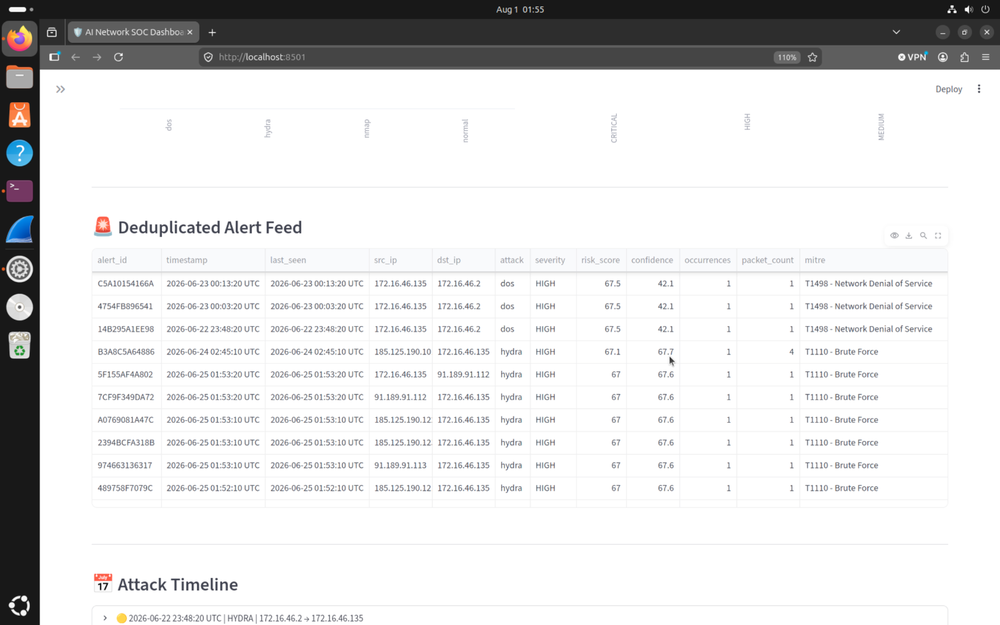
</p>

## Incident Timeline

The dashboard supports filtering by attack type and severity. Expanded incidents display the attack stage, severity, risk, confidence, occurrence count, and mapped technique.

### DoS Investigation

<p align="center">
  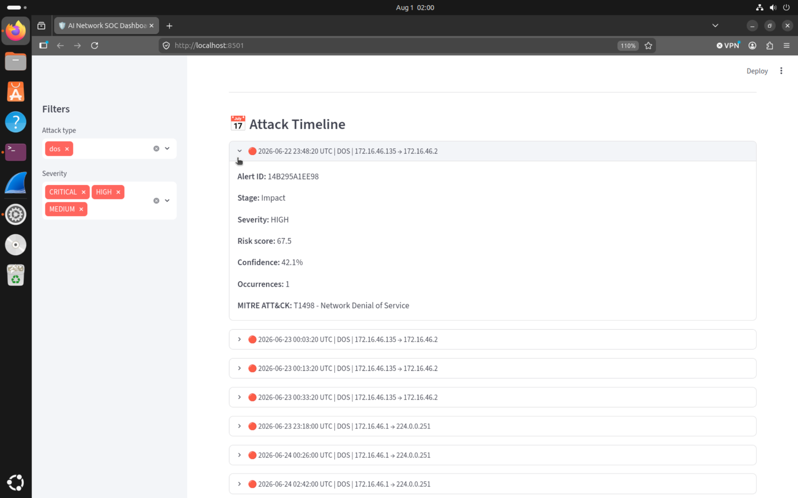
</p>

The DoS example is mapped to the **Impact** stage and `T1498 – Network Denial of Service`.

### Hydra Investigation

<p align="center">
  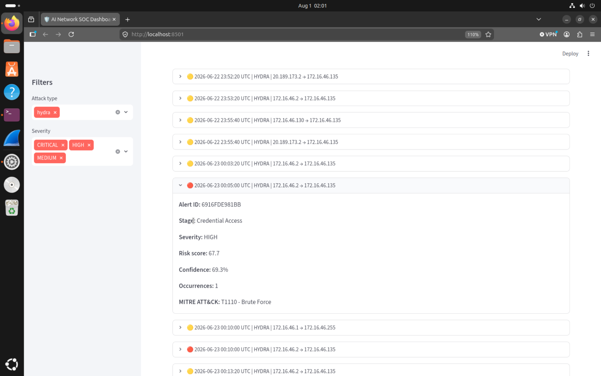
</p>

The Hydra example is mapped to **Credential Access** and `T1110 – Brute Force`.

## Model Analysis in the Dashboard

Feature importance and the confusion matrix are available directly from the analyst dashboard.

<p align="center">
  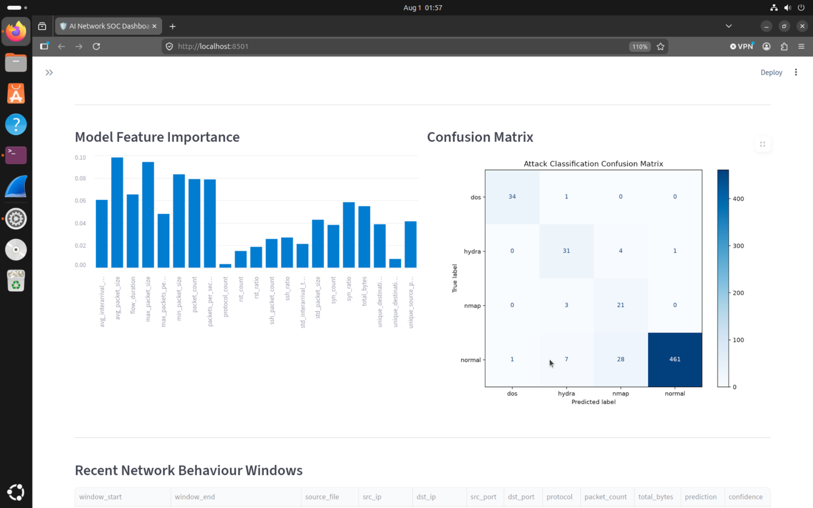
</p>

## Recent Network Behaviour Windows

The dashboard retains visibility into the underlying behavioural windows used for inference, including source file, addresses, ports, protocol, packet count, bytes, prediction, and model confidence.

<p align="center">
  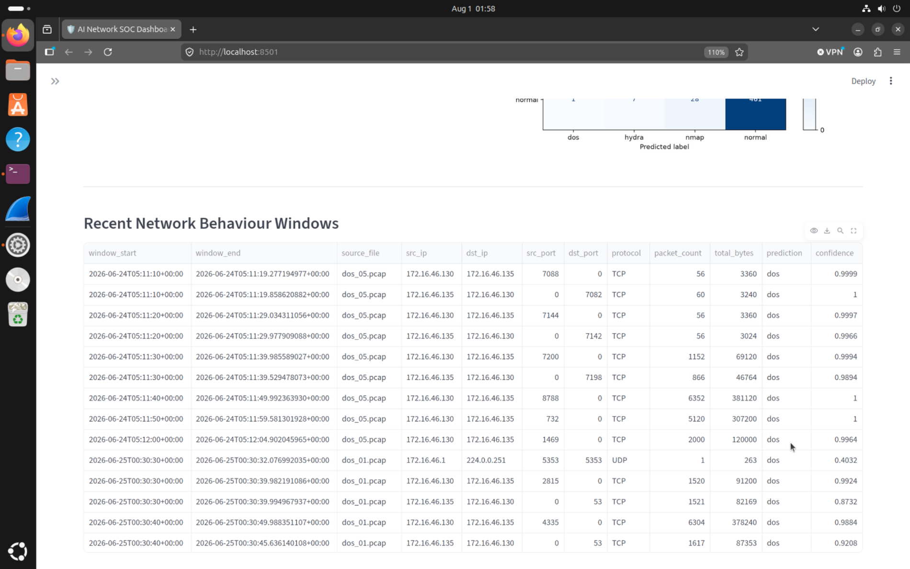
</p>

<details>
<summary><strong>Additional dashboard and execution evidence</strong></summary>

<br>

Streamlit application startup:

<p align="center">
  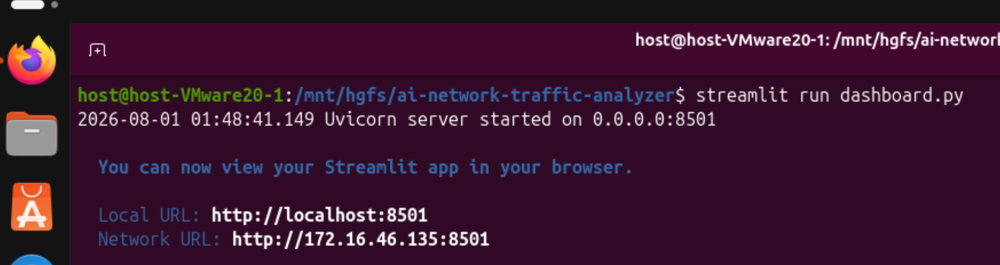
</p>

</details>

---

# MITRE ATT&CK Mapping

| Detection | Technique | Technique ID | Severity |
|---|---|---:|---|
| Nmap scan | Network Service Discovery | T1046 | Medium |
| Hydra SSH activity | Brute Force | T1110 | High |
| DoS traffic | Network Denial of Service | T1498 | Critical |

---

# Project Structure

```text
.
├── dashboard.py
├── train.py
├── test_phase1.py
├── requirements.txt
├── README.md
├── data
│   ├── raw
│   ├── processed
│   └── models
├── screenshots
└── src
    ├── core
    │   └── config.py
    ├── data
    │   └── data_builder.py
    ├── detection
    │   ├── attack_classifier.py
    │   └── predictor.py
    ├── features
    │   └── feature_extractor.py
    ├── parsers
    │   └── pcap_parser.py
    ├── visualization
    │   ├── alert_engine.py
    │   ├── severity.py
    │   └── timeline.py
    └── main.py
```

---

# Technology Stack

- Python
- Scapy
- Pandas
- NumPy
- Scikit-learn
- Streamlit
- Matplotlib
- Joblib
- Kali Linux
- Ubuntu Linux
- tcpdump
- Wireshark
- Nmap
- Hydra
- hping3
- MITRE ATT&CK

---

# Current Limitations

- The dataset was generated in a controlled lab rather than a production enterprise network.
- Normal traffic significantly outnumbers the attack classes.
- Nmap classifications currently produce more false positives than the other classes.
- MITRE ATT&CK mapping and base severity scores are rule-based.
- The dashboard analyzes stored captures rather than a continuous production packet stream.
- Prediction probabilities are not yet calibrated.

---

# Future Improvements

- Add destination-port entropy
- Add SYN-to-ACK and failed-connection ratios
- Add unique destinations and destination ports per second
- Tune Nmap confidence thresholds to reduce false positives
- Compare Random Forest with gradient-boosting classifiers
- Add probability calibration and precision-recall threshold analysis
- Add analyst states such as New, Investigating, and Closed
- Persist alerts in a database
- Add continuous or near-real-time packet processing
- Expand normal traffic and attack variants
- Add automated unit tests and CI validation

---

# Security and Data Handling

Raw PCAP captures and trained model binaries are excluded from version control.

The screenshots document a controlled lab environment. All private IP addresses, usernames, paths and other information is also excluded for making the repository public.

---

# Disclaimer

This project is intended exclusively for educational and defensive-security purposes. Attack simulations must only be performed on systems and networks that you own or are explicitly authorized to test.
