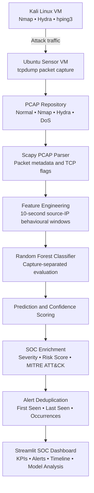
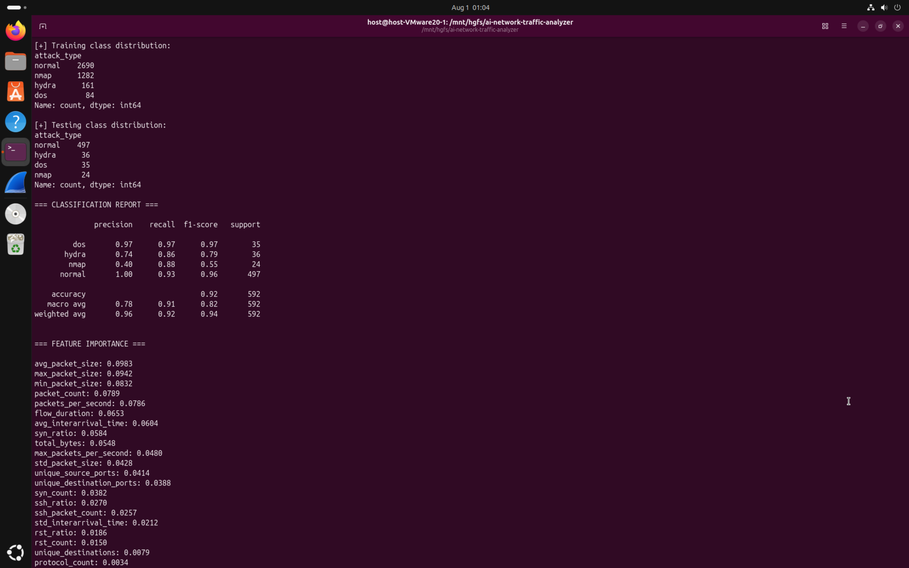
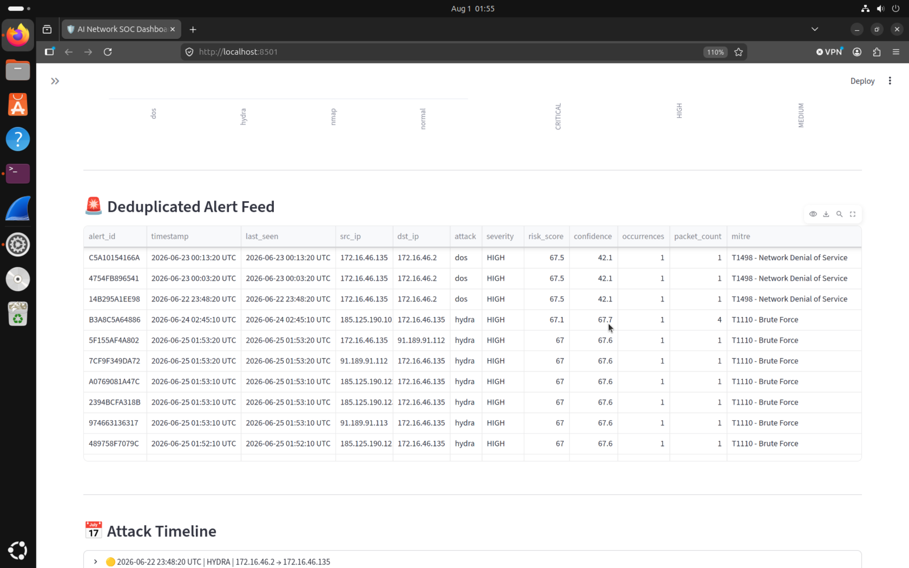
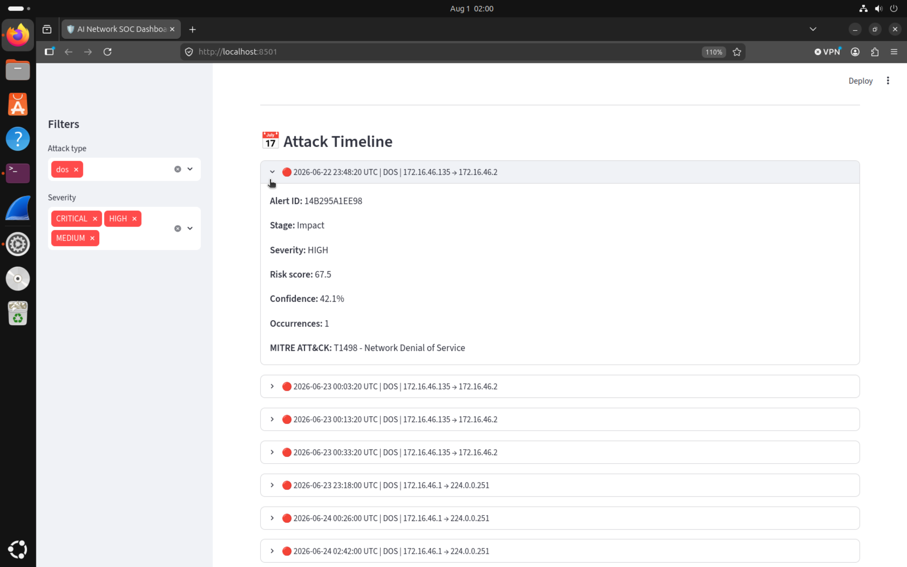
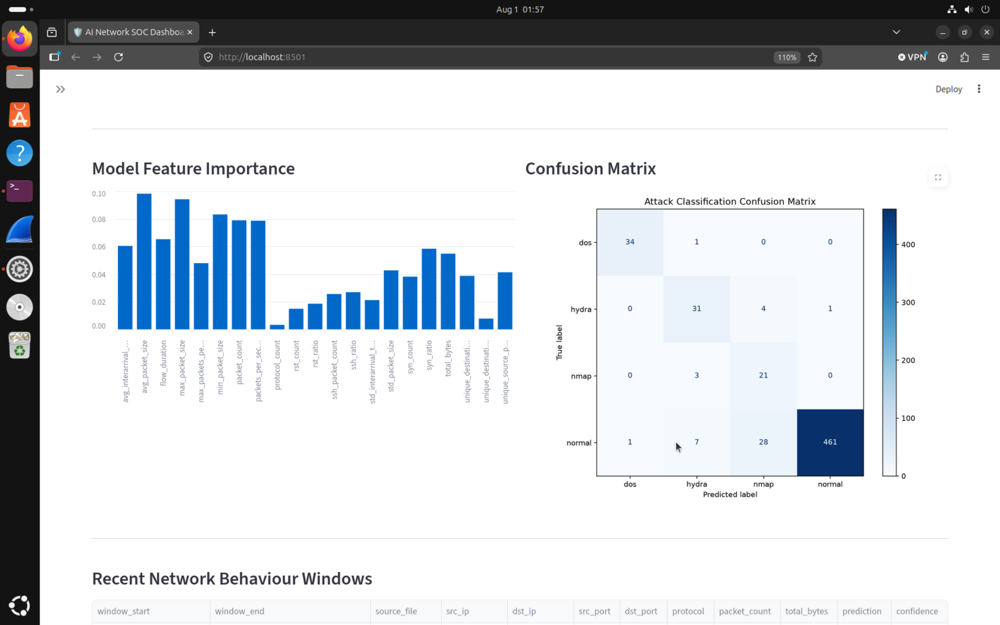
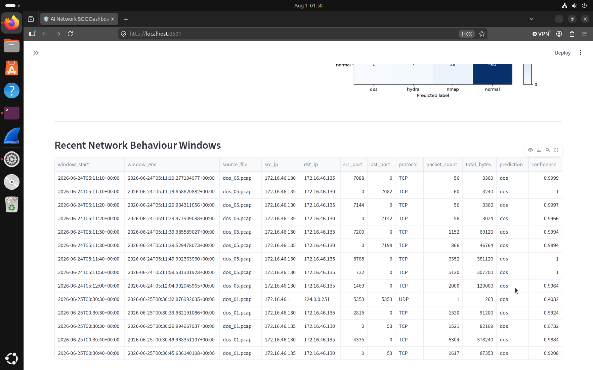

# AI-Powered Network Traffic Analyzer

An end-to-end network threat detection project that converts PCAP traffic into behavioural time windows, classifies simulated attacks with machine learning, enriches detections with severity and MITRE ATT&CK context, reduces duplicate alerts, and presents the results in a Streamlit SOC dashboard.

## Project Overview

In this lab, we simulate common network attacks from a Kali Linux VM against an Ubuntu sensor environment:

- Nmap port scanning
- Hydra SSH brute force
- hping3 denial-of-service traffic
- Normal network activity for baseline comparison

The pipeline uses Scapy to parse PCAP captures, creates 10-second source-IP behavioural windows, trains a Random Forest classifier, generates confidence-scored predictions, maps detections to MITRE ATT&CK, and displays alerts through an interactive dashboard.

## Architecture



## Pipeline

```text
Raw PCAP captures
        ↓
Scapy packet parsing
        ↓
10-second source-IP behavioural windows
        ↓
Feature extraction
        ↓
Capture-separated Random Forest training
        ↓
Attack predictions and confidence scores
        ↓
Severity and MITRE ATT&CK enrichment
        ↓
Alert deduplication
        ↓
Incident timeline
        ↓
Streamlit SOC dashboard
```

## Key Features

- Memory-efficient PCAP streaming with Scapy `PcapReader`
- Time-window-based behavioural feature extraction
- Source and destination IP/port metadata for investigation
- Random Forest multiclass attack classification
- Capture-separated training and testing to reduce data leakage
- Confidence scoring using `predict_proba()`
- SOC-style severity and risk scoring
- MITRE ATT&CK technique mapping
- Alert deduplication and occurrence tracking
- Interactive filtering by attack type and severity
- Feature-importance visualization
- Confusion-matrix analysis
- Chronological incident timeline

## Behavioural Features

The model uses numeric traffic characteristics such as:

- Packet count
- Average, standard deviation, minimum, and maximum packet size
- Total bytes
- Unique destinations
- Unique source and destination ports
- Protocol diversity
- Flow duration
- Packets per second
- SYN and RST counts and ratios
- SSH packet count and ratio
- Packet inter-arrival statistics
- Maximum packets per second

IP addresses, ports, timestamps, and source filenames are retained as analyst metadata but excluded from the model feature matrix.

## MITRE ATT&CK Mapping

| Detection | Technique | MITRE ATT&CK ID | Severity |
|---|---|---:|---|
| Nmap port scan | Network Service Discovery | T1046 | Medium |
| Hydra SSH brute force | Brute Force | T1110 | High |
| Denial-of-service traffic | Network Denial of Service | T1498 | Critical |

## Model Evaluation

The Random Forest classifier was evaluated using complete PCAP captures held out from training. This prevents windows from the same capture from appearing in both the training and testing sets.

### Classification Results

| Class | Precision | Recall | F1-score | Support |
|---|---:|---:|---:|---:|
| DoS | 0.97 | 0.97 | 0.97 | 35 |
| Hydra | 0.74 | 0.86 | 0.79 | 36 |
| Nmap | 0.40 | 0.88 | 0.55 | 24 |
| Normal | 1.00 | 0.93 | 0.96 | 497 |
| **Overall accuracy** |  |  | **0.92** | **592** |
| **Macro average** | **0.78** | **0.91** | **0.82** | **592** |
| **Weighted average** | **0.96** | **0.92** | **0.94** | **592** |

The classifier correctly classified **547 of 592** capture-separated test windows.

DoS and normal traffic showed the strongest performance. Nmap detection achieved **88% recall**, meaning most scans were identified, but its lower precision reflects false positives: 28 normal windows and 4 Hydra windows were classified as Nmap. This is presented as a realistic alert-fatigue challenge and an area for future scan-specific feature engineering and confidence-threshold tuning.




## Dashboard

The Streamlit dashboard provides:

- Total traffic-window count
- Suspicious-window count
- Deduplicated alert count
- Critical-alert count
- Attack and severity distributions
- Alert IDs and timestamps
- Source and destination details
- Model confidence
- Risk scores
- Alert occurrence counts
- MITRE ATT&CK mappings
- Interactive attack and severity filters
- Incident-stage timeline
- Feature importance
- Confusion matrix
- Recent network behaviour windows

### Dashboard Overview


### Deduplicated Alert Feed



### Incident Timeline



### Model Analysis



### Network Behaviour Windows



## Project Structure

```text
.
├── dashboard.py
├── train.py
├── test_phase1.py
├── requirements.txt
├── README.md
├── data
│   ├── raw
│   ├── processed
│   └── models
├── screenshots
└── src
    ├── core
    │   └── config.py
    ├── data
    │   └── data_builder.py
    ├── detection
    │   ├── attack_classifier.py
    │   └── predictor.py
    ├── features
    │   └── feature_extractor.py
    ├── parsers
    │   └── pcap_parser.py
    ├── visualization
    │   ├── alert_engine.py
    │   ├── severity.py
    │   └── timeline.py
    └── main.py
```

## Execution

Run the commands from the repository root.

### 1. Build the behavioural dataset

```bash
python3 -m src.data.data_builder
```

### 2. Train and evaluate the classifier

```bash
python3 train.py
```

### 3. Generate predictions, alerts, and timeline data

```bash
python3 -m src.main
```

### 4. Launch the SOC dashboard

```bash
python3 -m streamlit run dashboard.py
```

Generated artifacts include:

```text
data/models/attack_classifier.pkl
data/models/feature_columns.pkl

data/processed/dataset.csv
data/processed/classification_report.txt
data/processed/feature_importance.csv
data/processed/confusion_matrix.png
data/processed/predictions.csv
data/processed/alerts.csv
data/processed/timeline.csv
```

## Technology Stack

- Python
- Scapy
- Pandas
- NumPy
- Scikit-learn
- Streamlit
- Matplotlib
- Joblib
- Kali Linux
- Ubuntu Linux
- tcpdump
- Nmap
- Hydra
- hping3
- MITRE ATT&CK

## Security and Data Handling

The PCAP captures were generated in a local virtual environment and the raw PCAP files, trained model binaries, Python cache files are excluded.

## Current Limitations

- The training data comes from a controlled lab rather than a diverse production network.
- Normal traffic significantly outnumbers attack traffic.
- Nmap predictions currently generate more false positives than the other classes.
- MITRE mapping and severity scores are rule-based.
- The dashboard processes stored captures rather than a continuous production packet stream.
- Model confidence is not yet calibrated.

## Future Improvements

- Add destination-port entropy and SYN-to-ACK ratio
- Add unique ports and destinations per second
- Introduce confidence thresholds for Nmap alert suppression
- Compare Random Forest results with gradient boosting models
- Add probability calibration and precision-recall threshold analysis
- Add analyst workflow states such as New, Investigating, and Closed
- Add persistent alert storage
- Support continuous or near-real-time capture processing
- Expand the dataset with additional attack variants and normal traffic profiles
- Add automated tests and CI checks

## Learning Outcomes

This project demonstrates practical experience with:

- Network packet analysis
- PCAP processing
- Behavioural feature engineering
- Multiclass machine learning
- Security alert enrichment
- MITRE ATT&CK mapping
- False-positive analysis
- SOC dashboard design
- Python project organization
- End-to-end detection-pipeline development

## Disclaimer

This project was intended for learning purposes. Attack simulations should only be conducted in systems and networks that you own or are explicitly authorized to test.
